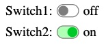
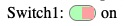

# @kekalma/switch for React

A flexible switch component for React, where you can change the look freely. The actual state can be stored in a context, whose value can be used in other parts of the project and/or you can use a callback handler.  
Part of the [@kekalma](https://www.npmjs.com/search?q=%40kekalma) component family.

## Usage example

The following example demonstrates the use of three independent switches, with separate context values, standalone and shared handler functions.  
It is optional to set up a context and/or a handler function, but one of them should be used.  
If an 'id' is set, the switchHandler callback function gets the 'id' parameter too.
<br> 

  

|switch #|context|handler|id|
|---|:---|:---|---|
|1|Context1|switchHandler1(newValue)||
|2|Context2|switchHandler(newValue,id)|switch2|
|3||switchHandler(newValue,id)|switch3|

<br>

__App.tsx__

```tsx
import React, { useState } from 'react'
import {Switch} from "@kekalma/switch"
import { switchContext1 as Context1} from "./context";
import { switchContext2 as Context2} from "./context";
import Info from "./Info";

export default function App() {
  const [switchMode1, setSwitchMode1] = useState(false);
  const [switchMode2, setSwitchMode2] = useState(false);
  const switchHandler1 = (newValue: boolean) => {
    console.log('Switch state 1:', newValue)
  }
  const switchHandler = (newValue: boolean, id: string) => {
    console.log(`Switch state '${id}' :`, newValue)
  return (
    <div style={{ display: "flex", flexWrap: "wrap" }}>
      <Context1.Provider 
        value={{ switchMode: switchMode1, setSwitchMode: setSwitchMode1 }}
      >
        <Switch
          context={Context1}
          label="Switch1:"
          initValue={false}
          onSwitch={switchHandler1}
        />
        <Info context={Context1}/>
      </Context1.Provider>
      <div style={{flexBasis: "100%", height: "10px" }}></div>
      <Context2.Provider 
        value={{ switchMode : switchMode2, setSwitchMode : setSwitchMode2 }}
      >
        <Switch
          id="switch2"
          context={Context2}
          label="Switch2:"
          initValue={true}
          onSwitch={switchHandler}
        />
        <Info context={Context2}/>
      </Context2.Provider>
      <div style={{ flexBasis: "100%", height: "10px" }}></div>
      <Switch
          id="switch3"
          label="Switch3:"
          initValue={false}
          onSwitch={switchHandler}
      />
    </div>
  )
}
```  

<br>

__context.ts__  

_Please note, the content of the context should have strict a `switchMode` and `setSwitchMode` value-pair, in the format in the example below!_

```javascript
import React from 'react'
import { switchContextType }  from '@kekalma/switch'

export const switchContext1 = React.createContext<switchContextType>({
  switchMode: false,
  setSwitchMode: (value: boolean)=>{}
})

export const switchContext2 = React.createContext<switchContextType>({
  switchMode: false,
  setSwitchMode: (value: boolean)=>{}
})
```  

<br>

__info.tsx__

_This is an example of how you can use the context value, destructed into an own variable, `switchValue`._

```tsx
import React, { useContext } from "react";
import { switchContextType } from "@kekalma/switch";

type myProps = { context: React.Context<switchContextType> };

export default function Info(props : myProps) {
  const { switchMode : switchValue } = useContext(props.context);
  return (
    <React.Fragment>
      <span style={{ margin: "0 5px" }}>
        {switchValue ? "on" : "off"}
      </span>
    </React.Fragment>
  );
}
```

<br>

## Property parameters

_All the property parameters are optional, but one from `onSwitch` or `context` should be used._

|property|format|Description|
|---|:---:|---|
|id|string|Identifier for the `onSwitch` callback function. Should only be used if multiple components are using the same handler function. See the example code.|
|onSwitch|Function<br>(newValue: boolean, id?: string)| The handler function for the change event.|
| context| React.Context<br>\<switchContextType> | The context, to store the state and the handler. See the above `context.ts` example for the format. |
|label|string| The label in \<span> element before the switch.|
|initialValue|boolean| [FALSE] The initial value upon creation of the component.|
|height|string| CSS value of the height.|
|width|string| CSS value of the width. This should be omitted.|
|borderON|string|(Optiona) CSS value  the border color if switched on.|
|borderOFF|string|(Option) CSS value  the border color if switched off.|
|colorON|string| CSS value  the knob color if switched on.|
|colorOFF|string| CSS value  the knob color if switched off.|
|bgColorON|string| CSS value  the background color if switched on.|
|bgColorOFF|string| CSS value of the background color if switched off.|
|switchStyle|React.CSSProperties| General inline CSS properties for the switch.|
|knobStyle|React.CSSProperties| General inline CSS properties for the knob.|


### __An example for using the style properties:__



```js
  <switch 
    //... main properties come here
    height = "1em"
    width = "1.7em"
    borderON = "#afa"
    colorON = "#6f6"
    bgColorON = "#dfd"
    switchStyle = {{ borderWidth: "3px" }}
    knobStyle = {{ borderRadius: 0 }}
  />
```

<br>

## __Exported type definitions (Typescript)__

|exported item|Description|
|---|---|
|switchProps|All the properties listed above|
|switchContextType|Context type definition|

<br>

## __`Changelog:`__

|Version|What's new, description|
|---|---|
|1.0.0|First official, working release.|

<br>

## License

MIT © [kissato70](https://github.com/kissato70)

<br>  

### __Support the project__ >>> [Donation](https://bit.ly/kissato70_paypal_donate)