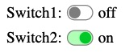

# @kekalma/switch

A flexible switch component for React, where you can change the look freely. The actual state is stored in a context, whose value can be used in other parts of the project.

## Usage example

The following example demonstrates the use of two independent switches, with separate context values and handler functions.
<br>  

  

<br>

__App.tsx__

```tsx
import React, { useState } from 'react'
import Switch from "@kekalma/switch"
import { switchContext1 } from "./context";
import { switchContext2 } from "./context";
import Info from "./Info";
import Info2 from "./Info2";

export default function App() {
  const [switchMode1, setSwitchMode1] = useState(false);
  const [switchMode2, setSwitchMode2] = useState(false);
  const switchHandler = (newValue) => {
    console.log('Switch state 1:', newValue)
  }
  const switchHandler2 = (newValue) => {
    console.log('Switch state 2:', newValue)
  }
  return (
    <div style={{ display: "flex", flexWrap: "wrap" }}>
      <switchContext1.Provider 
        value={{ switchMode: switchMode1, setSwitchMode: setSwitchMode1 }}
      >
        <Switch
          context={switchContext1}
          label="Switch1:"
          initValue={false}
          onSwitch={switchHandler}
        />
        <Info />
      </switchContext1.Provider>
      <div style={{flexBasis: "100%", height: "10px" }}></div>
      <switchContext2.Provider 
        value={{ switchMode : switchMode2, setSwitchMode : setSwitchMode2 }}
      >
        <Switch
          context={switchContext2}
          label="Switch2:"
          initValue={true}
          onSwitch={switchHandler2}
        />
        <Info2 />
      </switchContext2.Provider>
    </div>
  )
}
```  

<br>

__context.js__  

_Please note, the content of the context is strictly a `switchMode` and `setSwitchMode` value-pair, in the format below!_  

```javascript
import React from 'react'

export const switchContext1 = React.createContext({
  switchMode: false,
  setSwitchMode: ()=>{}
})

export const switchContext2 = React.createContext({
  switchMode: false,
  setSwitchMode: ()=>{}
})
```  

<br>

__info.tsx__

_This is an example of how tu use the context._

```tsx
import React, {useContext} from 'react'
import {switchContext1}  from './context'

export default function Info()
{
  const switchBox = useContext(switchContext1)
  return (
    <React.Fragment>
      <span style={{margin: "0 5px"}}>
        {switchBox.switchMode ? 'on' : 'off'}
      </span>
    </React.Fragment>
  )
}
```

<br>

## Property parameters
|property|format|Description|
|---|:---:|---|
| context| React.Context<br><switchContextType<boolean, () => {}>> | Required. The context, to store the state and the handler. See the above example for the format. |
|label|string|(Optional) The label text before the switch.|
|initialValue|boolean|(Optional) [FALSE] The initial value on creation.|
|onSwitch|Function|(Optional) The handler function for the change event.|
|height|string|(Optional) CSS value of the height.| 
|width|string|(Optional) CSS value of the width.| 
|borderON|string|(Optiona) CSS value  the border color if switched on.| 
|borderOFF|string|(Option) CSS value  the border color if switched off.| 
|colorON|string|(Optional) CSS value  the knob color if switched on.| 
|colorOFF|string|(Optiona) CSS value  the knob color if switched off.| 
|bgColorON|string|(Option) CSS value  the background color if switched on.| 
|bgColorOFF|string|(Optional) CSS value of the background color if switched off.|
|switchStyle|React.CSSProperties|(Optional) General CSS rules for the switch.|
|knobStyle|React.CSSProperties|(Optional) General CSS rules for the knob.|


### __An example for using the style properties:__
```js
  <switch 
    //... main properties come here
    height = "1em"
    width = "1.7em"
    borderON = "#afa"
    colorON = "#6f6"
    bgColorON = "#dfd"
    switchStyle = {{ borderWidth: "3px" }}
    knobStyle = {{ borderRadius: 0 }}
  />
```


<br>


## License

MIT © [kissato70](https://github.com/kissato70)

<br>  

### Support the project >>> [Donation](https://bit.ly/kissato70_paypal_donate)